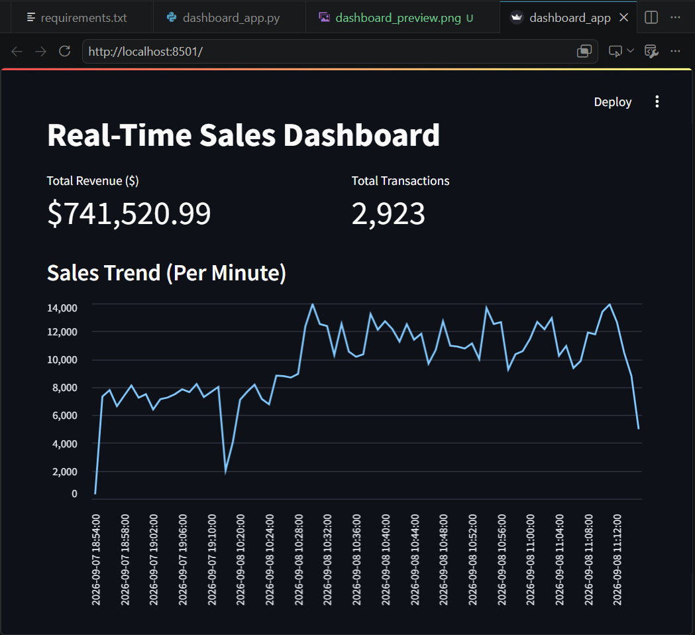

# 🚀 Real-Time E-Commerce Sales Pipeline & Operational Dashboard

[](https://realtime-sales-dashboard-8fxljp2acqp5bayfd8rkmd.streamlit.app/)
[](https://github.com/KolliChaithraJyotshna/Realtime-sales-dashboard)

## 📌 Executive Summary
In high-volume e-commerce environments, relying on end-of-day batch processing creates data latency, preventing business leadership from tracking live flash sales or identifying checkout drop-offs in real time.

This project implements an **end-to-end real-time data streaming and analytics pipeline**. It continuously ingests synthetic e-commerce sales transactions, executes low-latency per-minute window aggregations (ETL), persists metrics to an SQLite database, and streams real-time updates to an operational dashboard hosted live on Streamlit Cloud.

## 🖼️ Operational Dashboard Preview



> **Live Production App:** [View Deployed Streamlit Dashboard](https://realtime-sales-dashboard-8fxljp2acqp5bayfd8rkmd.streamlit.app/)

---

## 💡 Business Value & Key Benefits

In traditional enterprise analytics, sales metrics are updated via daily or weekly batch jobs. This project solves that latency issue by delivering an instant, automated stream of operational data:

- **Immediate Operational Visibility:** Allows revenue operations and store managers to monitor live flash sales, track order volumes, and spot sudden traffic drops as they happen.
- **Zero Manual Overhead:** Automated ETL (Extract, Transform, Load) replaces manual SQL queries and CSV exports.
- **Anomaly & Spike Detection:** Real-time trend visualization helps teams detect unexpected transaction spikes or checkout errors in minutes instead of days.
- **Scalable Data Architecture:** Demonstrates how low-latency event processing handles continuously streaming input without crashing or slowing down database queries.

## 🔄 System Architecture & Data Flow

`[ Event Producer ]` ---> `[ ETL Aggregator ]` ---> `[ SQLite Database ]` ---> `[ Live Streamlit UI ]`  
`(producer.py)` &nbsp;&nbsp;&nbsp;&nbsp;&nbsp;&nbsp;&nbsp;&nbsp;&nbsp;&nbsp;&nbsp;&nbsp;&nbsp;&nbsp; `(aggregator.py)` &nbsp;&nbsp;&nbsp;&nbsp;&nbsp;&nbsp;&nbsp;&nbsp;&nbsp;&nbsp;&nbsp;&nbsp; `(sales.db)` &nbsp;&nbsp;&nbsp;&nbsp;&nbsp;&nbsp;&nbsp;&nbsp;&nbsp;&nbsp;&nbsp;&nbsp;&nbsp;&nbsp;&nbsp;&nbsp;&nbsp;&nbsp; `(dashboard_app.py)`

1. **`producer.py` (Ingestion Layer):** Generates live synthetic transaction logs representing checkout events across time windows.
2. **`aggregator.py` (ETL Transformation):** Continuously reads raw log events, computes minute-level window totals (`total_sales`, `total_revenue`), and updates the analytical storage.
3. **`sales.db` (Storage Layer):** Persists normalized tables for raw event logs (`sales_events`) and aggregated summaries (`sales_summary_minute`).
4. **`dashboard_app.py` (Visualization Layer):** Auto-refreshes every 5 seconds to query SQLite and render dynamic KPI cards and line charts.


## 🗄️ Database Schema & Data Modeling

The system uses an SQLite database (`sales_db`) with a two-tier relational schema designed for low-latency streaming and aggregated analytics:

### 1. `sales_events` (Raw Ingestion Table)
Stores raw, unaggregated transaction records as they are streamed in real time.

| Column | Data Type | Description |
| :--- | :--- | :--- |
| `id` | INTEGER | Primary Key (Auto-incrementing) |
| `timestamp` | TEXT | Execution time (`YYYY-MM-DD HH:MM:SS`) |
| `amount` | REAL | Total transaction dollar value ($) |

### 2. `sales_summary_minute` (Aggregated Analytics Table)
Stores per-minute window metrics generated by the background ETL process (`aggregator.py`).

| Column | Data Type | Description |
| :--- | :--- | :--- |
| `minute_ts` | TEXT | Primary Key (Minute window: `YYYY-MM-DD HH:MM`) |
| `total_sales` | INTEGER | Count of completed transactions within the minute |
| `total_revenue` | REAL | Cumulative revenue ($) generated within the minute |

## 🛠️ Tech Stack & Key Libraries

- **Programming Language:** Python 3.10+
- **Data Transformation & Aggregation:** Pandas, NumPy
- **Storage Layer:** SQLite3
- **Interactive UI Framework:** Streamlit (`streamlit_autorefresh`)
- **Version Control & Cloud Hosting:** Git, GitHub, Streamlit Community Cloud

---

## 💻 Local Execution Guide

### Option 1: Standard Terminal Setup
```bash
# 1. Clone Repository & Install Dependencies
git clone [https://github.com/KolliChaithraJyotshna/Realtime-sales-dashboard.git](https://github.com/KolliChaithraJyotshna/Realtime-sales-dashboard.git)
cd Realtime-sales-dashboard
pip install -r requirements.txt

# 2. Launch Local Pipeline Processes
python producer.py
python aggregator.py
streamlit run dashboard_app.py

### Windows / Anaconda (if `python` is not in PATH)
If `python` is not recognized in your terminal, run using your Anaconda binary path:
1. `& "C:\Users\chait\anaconda3\python.exe" producer.py`
2. `& "C:\Users\chait\anaconda3\python.exe" aggregator.py`
3. `& "C:\Users\chait\anaconda3\python.exe" -m streamlit run dashboard_app.py`
